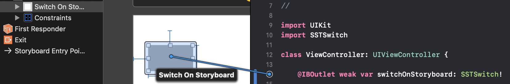
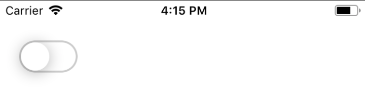
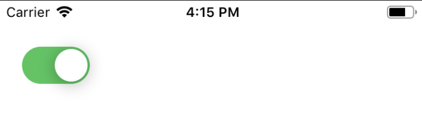

# SSTSwitch

[](https://travis-ci.org/bupstan/SSTSwitch)
[](https://cocoapods.org/pods/SSTSwitch)
[](https://cocoapods.org/pods/SSTSwitch)
[](https://cocoapods.org/pods/SSTSwitch)

## Example

To run the example project, clone the repo, and run `pod install` from the Example directory first.

## Requirements
- iOS 10.0+
- Swift 4.2+

## Installation

SSTSwitch is available through [CocoaPods](https://cocoapods.org). To install
it, simply add the following line to your Podfile:

```ruby
pod 'SSTSwitch'
```

## Usage
There are two ways to use the switches in this pod.

>1. Through Interface Builder and IBOutlet Initialization
>2. Initializing the button programmatically

- Import `SSTSwitch` in the class you want to use

```swift
import SSTSwitch
```

### Through Interface Builder and IBOutlet
- Drag and drop a `UIView` from the object Library and have its Width, Height, XY Constraints
- Connect to its file-owner with a type of `SSTSwitch`

<br>

- You **MUST** set its `delegate` to the class file that will listen to this switch's state changes. You also can specify its `switchType` and other properties.

```swift
@IBOutlet weak var switchOnStoryboard: SSTSwitch!

// You can set it up in viewDidLoad()
override func viewDidLoad() {
  super.viewDidLoad()
  // Clearing the backgroundColor we set in the InterfaceBuilder for visibility during that time.
  switchOnStoryboard.backgroundColor = .clear
  switchOnStoryboard.switchType = .ios
  switchOnStoryboard.delegate = self
}
```

- Setting the delegate will require the class file to conform to the SSTSwitchDelegate protocol. In this case the class `ViewController` will be conforming to it.

```swift
extension ViewController: SSTSwitchDelegate {
  func didToggleSwitch(currentState: SSTSwitchState) {
    if currentState == .on {
      // Handle On Actions here
      print("Switch is On")
    } else {
      // Handle Off Actions here
      print("Switch is Off")
    }
  }
}
```
- It will show up like this

<br>


### Initializing Programmatically
**SSTSwitch** has an initializer that accepts one mandatory `type` argument and many other optional ones. However, the optional arguments can be set explicitly with the properties through runtime.

- Initialize **SSTSwitch**. After the code below a **SSTSwitch** with *on* state will be initialized 

```swift
let codeSwitch = SSTSwitch(type: .material, state: .on)
```
- Its delegate **MUST** be set to a class and its X,Y Position Constraints **MUST** also be added to appear correctly.

```swift
codeSwitch.delegate = self
self.view.addSubview(codeSwitch)
codeSwitch.translatesAutoresizingMaskIntoConstraints = false
codeSwitch.centerXAnchor.constraint(equalTo: self.view.centerXAnchor, constant: 0).isActive = true
codeSwitch.centerYAnchor.constraint(equalTo: self.view.centerYAnchor, constant: 0).isActive = true
```
- Now the class needs to conform to the `SSTSwitchDelegate`

```swift
extension ViewController: SSTSwitchDelegate {
  func didToggleSwitch(currentState: SSTSwitchState) {
    if currentState == .on {
      // Handle On Actions here
      print("Switch is On")
    } else {
      // Handle Off Actions here
      print("Switch is Off")
    }
  }
}
```
- And that's it! The switch will look like this

<br>


## Customizable Properties

### Switch Type
There are four types of switches currently implemented.

- iOS Switch
- iOS Switch with Image
- Material Switch
- Rounded Switch

You can change the type of the switch as following

```swift
let codeSwitch = SSTSwitch(type: .ios)

// iOS Switch
codeSwitch.switchType = .ios

// iOS Switch with Image, you have to specify its image to have it appear in the knob
codeSwitch.switchType = .iosImg
codeSwitch.image = UIImage(named: "grape")

// Material Switch
codeSwitch.switchType = .material

// Rounded Switch, you can specify custom corner radius for this type
codeSwitch.switchType = .rounded
codeSwitch.switchCornerRadius = 20
```

### State
You can specify the state of the switch through `state` property for all types of switches.

```swift
let codeSwitch = SSTSwitch(type: .ios)

// Have it on
codeSwitch.state = .on

// or Have it off
codeSwitch.state = .off

// Note that this changes state instantly, therefore this property should only be used for the starting state.

// You will see additional states (onSuspendState and offSuspendState) through the auto-completion. They should be ignored.
```

### Colors for On and Off States (for both Knob and Crease)
These colors come with default values that are relative to your `switchType`. However, you can specify your own custom colors for each state of the knob and crease. *Knob: the grabber thing, Crease: the slider thing*

```swift
let codeSwitch = SSTSwitch(type: .ios)

// On-Color for the Knob
codeSwitch.activeColorKnob = .red

// Off-Color for the Knob
codeSwitch.idleColorKnob = .blue

// On-Color for the Crease
codeSwitch.activeColorCrease = .gray

// Off-Color for the Crease
codeSwitch.idleColorCrease = .lightGray
```
The properties are pretty much self-explanatory.

### Image Padding for iOS Image Type
You can specify the padding the image will have inside the knob. The default value is zero.

```swift
let codeSwitch = SSTSwitch(type: .iosImg)
codeSwitch.image = UIImage(named: "grape")

// 5 means that the image will be padded 5 points all around
codeSwitch.imgPadding = 5
```

## Author

bupstan, bupstan.dev@gmail.com

## License

SSTSwitch is available under the MIT license. See the LICENSE file for more info.
